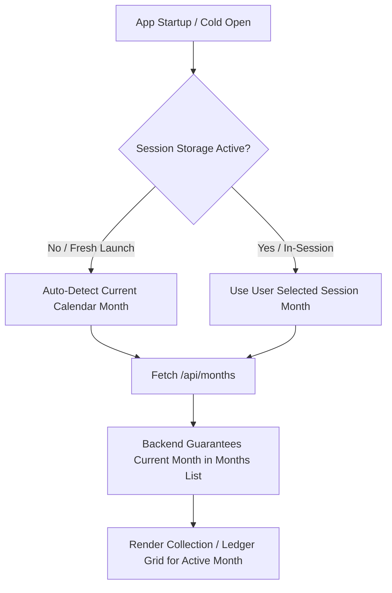

# Implementation Plan: Clean Client & Cycle Data and Auto-Current Month System

Fix the persistent "stuck in May" issue by establishing automatic current calendar month detection on fresh app launch, preserving active month selection during user sessions, removing hardcoded '2026-05' fallbacks across the backend and frontend, and cleaning up corrupted/deleted test data and junk test companies from the live database.

---

## User Review Required

> [!IMPORTANT]
> **Data Cleaning Action**:
> In the live Turso database, automated test runs created 6 test companies (`comp_139580_...`, `comp_927584_...`, etc.), 13 test lines, and marked all 5 clients as `deleted` and cycles as `closed`. The primary legitimate company is `comp_alr_001` (**ALR Finance**).
> 
> We will clean out all test companies and test records, restore the legitimate borrower **வெள்ளையம்மா w /o கரிகாலன்** (Sl.No 3032, Phone 9585194934) with `status = 'active'`, and create clean active loan cycles for both the **Current Calendar Month** and May 2026 (for historical record & test compatibility).

> [!NOTE]
> **Month Navigation Behavior**:
> - **On Cold Start / Reopening after long time**: The app will automatically default to the **Current Calendar Month** (e.g., September/October 2026).
> - **During Active Session**: If the user explicitly switches to an older month (e.g. May or June) to inspect past registers, their selected month is preserved in `sessionStorage` while working across tabs and pages.
> - **One-Click Jump**: A visible "Current Month" badge and quick button in the header/picker allows instant return to the current month anytime.

---

## Root Causes of Identified Issues

### 1. Why Was It Stuck in May Month?
1. **Destructive Fallback in `src/App.jsx` (Lines 57-66)**:
   ```javascript
   setActiveMonthState(curr => {
     if (data.data.length > 0 && !data.data.some(m => m.month_year === curr)) {
       const fallbackMonth = data.data[0].month_year;
       localStorage.setItem('alr_active_month', fallbackMonth);
       return fallbackMonth;
     }
     return curr;
   });
   ```
   Because `loan_cycles` only contained May 2026 (`2026-05`), `/api/months` only returned `2026-05`. When the app booted with the current month (e.g. `2026-09`), `data.data.some(...)` evaluated to `false`, and `App.jsx` forcibly smashed `activeMonth` back to `2026-05` and saved it to `localStorage`!
2. **Missing Current Month in `/api/months` (`server/routes/months.js`)**:
   The backend queried `SELECT DISTINCT month_year FROM loan_cycles`. If the current month had no loans created yet, it was completely absent from the months list, causing the frontend to treat the current month as invalid.
3. **Hardcoded Fallbacks to `'2026-05'`**:
   - `server/routes/clients.js`: `month_year = '2026-05'`
   - `server/routes/rollover.js`: `from_month = '2026-05'`
   - `server/routes/excel.js`: `month_year = '2026-05'`
   - `server/routes/collections.js`: `monthYear = '2026-05'`
   - `src/components/ClientFormModal.jsx`: `month_year: monthYear || '2026-05'`
4. **Persistent `localStorage` without Expiration**:
   `localStorage.getItem('alr_active_month')` retained old months indefinitely across days and weeks.

### 2. Client and Cycle Data Issues
1. **Corrupted / Deleted Status**:
   All 5 clients in Turso DB have `status: 'deleted'` and all cycles are `status: 'closed'`.
2. **Test Artifacts Polluting Database**:
   6 test companies (`comp_139580_a690ca`, `comp_927584_5f2375`, `comp_048845_dbc1fe`, `comp_618630_46aa48`, `comp_074545_0506c2`, `comp_158371_1425c9`) with 13 lines and 4 staff agents exist in Turso Cloud.
3. **Broken Test Runner**:
   `npm test` fails at Phase 0 because client 3032 was deleted.

---

## Proposed Changes



---

### Component 1: Month Management & Frontend Date Architecture

#### [NEW] `src/utils/date.js`
- Create standard date helpers for the frontend:
  - `getCurrentMonthYear()`: returns `YYYY-MM` for current local time.
  - `getCurrentMonthDays()`: returns total days in current month.
  - `isCurrentMonth(monthYear)`: boolean check.
  - `getSessionActiveMonth()` and `setSessionActiveMonth(m)`: manages `sessionStorage` with graceful fallback to `getCurrentMonthYear()`.

#### [MODIFY] `src/App.jsx`
- Replace `localStorage` with `sessionStorage` for active month selection.
- Default to `getCurrentMonthYear()` on startup.
- In `loadMonths`, **remove the destructive forced fallback** that rewrites the active month to `data.data[0]`. If `activeMonth` is a valid `YYYY-MM`, respect it.

#### [MODIFY] `src/components/MonthYearPicker.jsx`
- Add a clear "Current Month" status badge and highlight for the active month.
- Ensure clicking "Current Month" updates the session state and switches view immediately.

#### [MODIFY] `src/components/ClientFormModal.jsx`
- Replace hardcoded `'2026-05'` with `monthYear || getCurrentMonthYear()`.

---

### Component 2: Backend Dynamic Month Handling

#### [MODIFY] `server/routes/months.js`
- In `router.get('/')`: Always include the current calendar month in the returned array if it is not already present from `loan_cycles`. Ensure proper client count (`0` if no loans yet), principal sum, and day count.
- Order all months chronologically.

#### [MODIFY] `server/routes/clients.js`
- Replace `month_year = '2026-05', cycle_name = 'May 2026'` with dynamic current month:
  ```javascript
  const currentMonth = sanitizeMonthYear(req.body.month_year);
  ```

#### [MODIFY] `server/routes/collections.js`
- Replace hardcoded `'2026-05'` fallbacks with `sanitizeMonthYear()`.

#### [MODIFY] `server/routes/excel.js`
- Replace hardcoded `'2026-05'` in template export, preview, and import routes with `sanitizeMonthYear(req.body?.month_year || req.query?.month_year)`.

#### [MODIFY] `server/routes/rollover.js`
- Replace hardcoded `'2026-05'` with `sanitizeMonthYear(req.query.from_month)`.

---

### Component 3: Database Cleaning & Seed Integrity

#### [NEW] `scripts/clean_and_repair_data.js`
- Create a dedicated, idempotent database cleanup script:
  1. Purge all test companies (`comp_139580_...`, `comp_927584_...`, etc.) and their orphaned lines, agents, clients, cycles, and collections.
  2. Restore and activate client 3032 (`வெள்ளையம்மா w /o கரிகாலன்`) under `comp_alr_001` with `status = 'active'`.
  3. Ensure a clean active cycle exists for client 3032 in the **Current Calendar Month** (e.g. `2026-09` or `2026-10`) as well as `2026-05`.
  4. Recalculate and verify 0 orphaned records and full referential integrity.

#### [MODIFY] `server/seed.js`
- Update seed script to seed client 3032 for both May 2026 and the Current Month dynamically.
- Ensure existing client status is reset to `active`.

---

## Verification Plan

### Automated Tests
1. **Database & Core Tests**:
   ```bash
   node test/phase0.test.js
   ```
   Verify Client 3032 exists, is active, and collections calculate correctly.
2. **Full Test Suite**:
   ```bash
   npm test
   ```
   Verify all 23 test suites pass 100% green.
3. **Current Month & Session Logic Test [NEW]**:
   ```bash
   node --test test/current_month_and_data_cleanup.test.js
   ```
   - Test that `/api/months` always contains the current calendar month.
   - Test that new clients created without `month_year` default to the current month.
   - Test that cold start defaults to current month.
   - Test that no test companies or orphaned cycles exist.
4. **Production Build**:
   ```bash
   npm run build
   ```
   Ensure Vite bundle builds with zero errors.

### Manual Verification
1. Launch dev server (`npm run dev`).
2. Open `http://localhost:5173/` in a fresh browser window:
   - Verify the header and ledger grid automatically show the **Current Calendar Month** (September 2026).
   - Verify borrower `வெள்ளையம்மா w /o கரிகாலன்` is visible and active.
3. Click Month Picker and navigate to `May 2026`:
   - Verify May 2026 ledger loads with historical entries.
4. Click "Current Month" button:
   - Verify instant return to the current month.
5. Close tab and reopen in new tab:
   - Verify it opens directly into the **Current Month** automatically.
