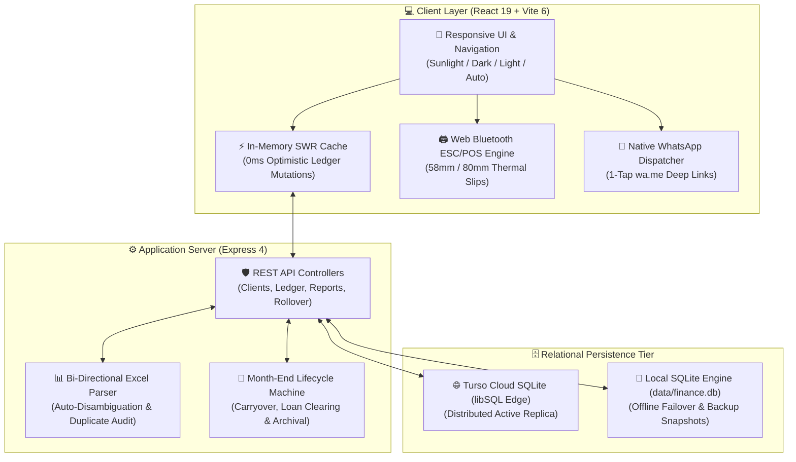

# 🏛️ Daily Collection Finance Manager (ALR Microfinance)
### தினசரி வசூல் மற்றும் கடன் மேலாண்மை மென்பொருள்

[](https://nodejs.org/)
[](https://react.dev/)
[](https://vitejs.dev/)
[](https://turso.tech/)
[](./src/i18n/ta.json)
[](https://github.com)
[](./test/)
[](./src/)

An enterprise-grade, **zero-recurring-cost**, offline-resilient microfinance ledger and field collection operations platform. Specifically engineered to digitize paper collection registers and manual Excel workbooks (ALR Daily Collection Register) utilized by micro-lenders, daily thavanai operators, and field finance agents across Tamil Nadu.

---

## ⚡ Executive Overview & The Zero Recurring Cost Architecture

Traditional finance management platforms burden rural microfinance businesses with steep monthly SaaS subscriptions, per-message WhatsApp Business API fees, cloud server hosting fees, and proprietary printer driver licenses. 

**Daily Collection Finance Manager eliminates 100% of these recurring costs**:

| Capability | Traditional SaaS Approach | ALR Finance Architecture | Operational Savings |
| :--- | :--- | :--- | :--- |
| **Database** | Managed RDS / Cloud SQL ($40–$120/mo) | **Turso Cloud SQLite Edge** (`@libsql/client`) with zero-latency local fallback | **100% Free** |
| **WhatsApp Receipts** | Meta Cloud API ($0.0099 – $0.05 / msg) | **Native `wa.me` Deep-Link Engine** with auto-templated Tamil & English text | **100% Free** |
| **Thermal Printing** | Proprietary vendor drivers / cloud print | **Direct Web Bluetooth ESC/POS** & Native `@media print` 58mm/80mm engine | **100% Free** |
| **Spreadsheet Sync** | Manual transcription / human error | **Bi-Directional SheetJS Engine** with intelligent column auto-disambiguation | **Zero Data Entry Overhead** |
| **Field Collection** | Requires constant 4G/5G connection | **Offline-First SWR Caching** with automatic background cloud synchronization | **Zero Network Dropouts** |

---

## 🏗️ System Architecture



---

## 💎 Core Feature Highlights

### 1. 📑 31-Day Interactive Ledger Spreadsheet
* **Desktop Freeze-Panes**: Permanent left-side anchor for Sl.No, Borrower Name, Contact Number, Route/Village, and Principal Amount; scrollable day columns (Days 1–31); fixed right-side anchor for Total Collected, Balance Due, and Actions.
* **Header Grand Totals**: Real-time aggregation cards displaying active cycle principal, collected thavanai sums, outstanding loan balances, and daily collection totals.
* **Keyboard Velocity**: Effortless directional navigation (`ArrowUp`, `ArrowDown`, `Tab`, `Enter`) with auto-select on focus for high-speed field collection entry.
* **Undo Safeguard**: Floating 8-second undo toast with live visual countdown preventing accidental keystroke overrides.

### 2. 📱 Field Collection Mobile Cards & Sunlight Mode
* **Ergonomic Touch Targets**: Form-fitted collection cards optimized for one-thumb field operation while riding routes or walking outdoor bazaars.
* **Quick-Increment Chips**: 1-tap fast payment entries (`+₹100`, `+₹200`, `+₹500`, and `Full Due` / `முழு நிலுவை`).
* **Instant Borrower Dial**: 1-tap phone dialing trigger for rapid on-the-road borrower communications.
* **Sunlight Outdoor Mode**: Contrast-maximized display preset (`#000000` text on `#FFFFFF` high-visibility card surfaces) for crisp readability under harsh noon sun.

### 3. 💬 Zero-Cost WhatsApp & Bluetooth Thermal POS Receipts
* **Bilingual WhatsApp Slips**: 1-tap instant messages in concise Tamil or English:
  * **Tamil**: `வணக்கம் [பெயர்], [தேதி] வசூல் தொகை: ₹[தொகை]. மீதமுள்ள நிலுவை: ₹[நிலுவை]. நன்றி, [கடை பெயர்].`
  * **English**: `Dear [Name], Collection received on [Date]: ₹[Amount]. Remaining balance: ₹[Balance]. Thank you, [Shop Name].`
* **Direct Web Bluetooth Printing**: Connects directly from Chrome/Edge to portable 58mm mobile belt printers and 80mm counter POS thermal printers without installing third-party apps or drivers.
* **Immutable Audit Trail**: Dispatches and receipts are logged in the `whatsapp_logs` table for dispute resolution.

### 4. 📊 Intelligent Excel Hub & Auto-Disambiguation Engine
* **Bi-Directional Excel Synchronization**: Download pre-formatted `.xlsx` workbooks with active Excel `=SUM()` and `=IF()` formulas, or upload existing field spreadsheets.
* **Intelligent Column Auto-Detection**: Automatically identifies header rows and intelligently differentiates between **Borrower Name**, **Village / Town**, and **Route Area / Ward** across both Tamil and English column labels.
* **Pre-Import Duplicate Guard**: Scans incoming spreadsheets and immediately warns if a mobile number is duplicated within the file or already belongs to an active borrower in the database.
* **Audit Inspection Table**: Interactive pre-commit modal previewing validated entries, missing fields, and formatting anomalies before writing to the database.

### 5. 🔄 Month-End Rollover & Loan Closure Archive
* **Rollover Wizard**: Automated transition from the closing month to the new collection cycle with clear visual diffs.
* **Automatic Balance Carryover**: Outstanding balances on day 31 automatically become the new opening principal for the subsequent cycle.
* **Zero Residual Overlap**: Fully repaid borrowers are automatically excluded from the next active ledger cycle.
* **Closed Accounts Vault**: Fully settled loans are preserved in a dedicated historical archive with full payment snapshots, closure timestamps, and 1-tap reopening capabilities.

### 6. 💼 Evening Cash Denomination Handover
* **Currency Counter**: Instant reconciliation breakdown for Indian Rupee banknotes (`₹500`, `₹200`, `₹100`, `₹50`, `₹20`, `₹10`).
* **Handover Locking**: Compares physical cash counted by field collection agents against digital collections recorded in the 31-day ledger, highlighting surplus or deficit balances.

### 7. 🛡️ 1-Click Database Disaster Recovery
* **Instant SQLite Snapshots**: Safely checkpoints the SQLite Write-Ahead Log (WAL) and downloads a standalone `finance.db` binary file.
* **Full JSON Portability**: Cross-platform schema and table backup capturing all clients, cycles, ledger records, settlements, and logs.
* **1-Click Binary Restore**: Instant drag-and-drop database recovery.

### 8. 🌐 Bilingual Engine & Universal Spotlight Search
* **Tamil & English Parity**: 100% complete bilingual interface (தமிழ் & English) with instantaneous language switching.
* **Super-Spotlight Search (`Ctrl + K`)**: Universal fuzzy search modal providing sub-50ms borrower search across serial numbers, client codes, phone numbers, villages, and names.

---

## 🔒 Security & Zero Data Leak Guarantee

* **Zero Binary Data Leaks**: Customer registers and financial `.xlsx` spreadsheets are excluded from git version control via `.gitignore`.
* **On-Demand Test Fixtures**: All automated integration test suites synthesize realistic test fixtures dynamically in memory, ensuring that no sensitive borrower PII or real-world ledgers are committed.
* **Zero Telemetry or Third-Party Analytics**: No Google Analytics, tracking beacons, or third-party marketing pixels. 100% of data stays between your browser and your database.
* **Isolated Environment Configurations**: Credentials and API tokens are managed strictly via `.env` files and never hard-coded.

---

## 🚀 Quick Start Guide

### System Prerequisites
* **Node.js**: v20.0.0 or higher
* **npm**: v10.0.0 or higher

### 1. Installation
```bash
# Clone the repository
git clone https://github.com/SanthaKumar-K-2004/Finance-tracker.git
cd Finance-tracker

# Install application dependencies
npm install
```

### 2. Configure Environment Variables
Copy the template configuration file:
```bash
cp .env.example .env
```
Configure your credentials in `.env`:
```ini
DATABASE_MODE=turso
TURSO_DATABASE_URL=libsql://your-db-name.turso.io
TURSO_AUTH_TOKEN=your-turso-auth-token
PORT=5000
NODE_ENV=development
```
*(If no Turso credentials are provided, the system automatically defaults to local SQLite at `./data/finance.db`)*

### 3. Initialize Database & Seed Baseline Data
```bash
npm run seed
```

### 4. Launch Development Environment
```bash
npm run dev
```
* **Frontend Application**: `http://localhost:5173`
* **Backend REST API**: `http://localhost:5000`

---

## 🧪 Comprehensive Automated Test Suite

The project includes an extensive suite of automated unit, integration, and security tests:

```bash
# Execute all test suites
npm test

# Run Excel parser & auto-disambiguation suite
node --test test/duplicate_and_area_village_preview.test.js

# Run client dataset validation suite
node --test test/client_excel_test_validation.test.js
```

### Build Production Bundle
```bash
npm run build
```
Generates an optimized, minified production build in `./dist`.

---

## 📂 Project Structure

```
FINACE PROJECT/
├── server/
│   ├── app.js                   # Express application setup & middleware
│   ├── index.js                 # HTTP server entrypoint
│   ├── db.js                    # Turso libSQL client & SQLite fallback engine
│   ├── seed.js                  # Database initializer & schema migrations
│   ├── syncLocalDb.js           # Cloud-to-local replication utility
│   ├── routes/
│   │   ├── clients.js           # Borrower registration, phone validation & search
│   │   ├── collections.js       # 31-day ledger grid entries & WhatsApp logs
│   │   ├── months.js            # Monthly cycle management & statistics
│   │   ├── rollover.js          # Month-end rollover & loan carryover engine
│   │   ├── reports.js           # Financial KPIs, recovery analytics & settlements
│   │   ├── excel.js             # Excel template generation, preview & ingestion
│   │   ├── company.js           # Shop branding, address & receipt customization
│   │   └── backup.js            # Binary .db & JSON snapshot backup/restore
│   └── utils/
│       ├── excelParser.js       # Header auto-detection & column disambiguation
│       └── receipt.js           # Bilingual WhatsApp templates & ESC/POS receipts
├── src/
│   ├── main.jsx                 # React root application entrypoint
│   ├── App.jsx                  # Main routing, layout & global state
│   ├── index.css                # CSS design system, typography & thermal print rules
│   ├── components/
│   │   ├── Layout.jsx           # Top navigation bar, language toggle & month selector
│   │   ├── MonthYearPicker.jsx  # Interactive calendar cycle navigator
│   │   ├── SpotlightSearchModal.jsx # Ctrl+K universal fast search modal
│   │   ├── ReceiptModal.jsx     # WhatsApp & Bluetooth 58mm/80mm receipt dialog
│   │   ├── CashDenominationModal.jsx # Evening cash handover settlement counter
│   │   ├── RolloverWizard.jsx   # Month-end cycle rollover wizard
│   │   ├── ClientFormModal.jsx  # Borrower creation & duplicate check modal
│   │   └── BulkEntryModal.jsx   # Multi-borrower batch installment entry modal
│   ├── pages/
│   │   ├── CollectionPage.jsx   # 31-day spreadsheet grid & mobile card views
│   │   ├── Dashboard.jsx        # Business intelligence KPIs, charts & defaulters
│   │   ├── ClientsPage.jsx      # Borrower directory & credit management
│   │   ├── ClosedClientsPage.jsx# Closed loans & recovery archive
│   │   ├── ExcelPage.jsx        # Excel import/export management hub
│   │   └── SettingsPage.jsx     # Shop profile, theme options & backup center
│   ├── hooks/
│   │   └── useNetworkStatus.js  # Network listener & offline queue sync hook
│   └── utils/
│       ├── bluetoothPrinter.js  # Web Bluetooth ESC/POS raw printer driver
│       └── offlineQueue.js      # LocalStorage payment queue for offline operation
├── scripts/
│   ├── generate_client_test_dataset.js    # On-demand test workbook generator
│   └── generate_duplicate_test_excel.js   # On-demand stress-test generator
└── test/                        # 29 Comprehensive automated test suites
```

---

## 📜 License

Licensed under the [MIT License](./LICENSE). Designed and crafted with pride for the microfinance and daily collection business community.
