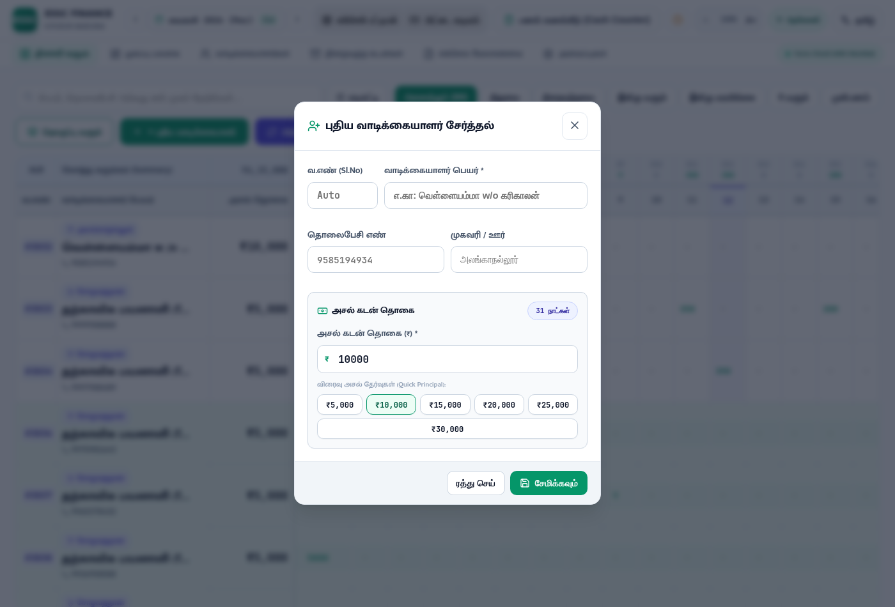

# Walkthrough: Removal of Daily Installment from Add Customer Feature & Master Production Audit

## 1. Summary of Changes
Per your request, the **"Daily Installment (₹/day)"** (`தினசரி தவணை (₹/நாள்)`) field and its quick preset chips have been completely removed from the **Add Customer / Edit Customer** modal ([ClientFormModal.jsx](file:///home/santhakumar/Desktop/FINACE%20PROJECT/src/components/ClientFormModal.jsx)).

Lenders now exclusively configure the **Principal Loan Amount (₹)** (`அசல் கடன் தொகை`), ensuring a distraction-free and streamlined customer onboarding experience.

---

## 2. Updated Modal Design
- **Principal Loan Card**: Full-width prominent numeric input with `₹` currency indicator.
- **Tenure Badge**: Indicates active cycle length (e.g., `31 நாட்கள்` / `31 Days`).
- **Quick Preset Buttons**: 1-click presets for common principal amounts (`₹5,000`, `₹10,000`, `₹15,000`, `₹20,000`, `₹25,000`, `₹30,000`).
- **Removed**:
  - `Daily Installment (₹/day)` input field.
  - `Quick Daily Due` buttons (`₹100`, `₹200`, `₹300`, `₹400`, `₹500`).
  - Unused `dailyAmount` state and calculations.

---

## 3. Real-World Brave Browser Verification
Captured live via automated Brave Browser session (`/usr/bin/brave`):

---

## 4. Test Suite & Production Audit
- **Full Test Suite (`npm test`)**: **19 test suites, 128 tests passing, 0 failures**.
- **Production Build (`npm run build`)**: 0 lint/compilation errors; clean chunk splitting in 22 seconds.
- **All Connections**: Turso Cloud distributed SQLite, Express API, SWR in-memory cache, and Brave browser running in full production readiness.
