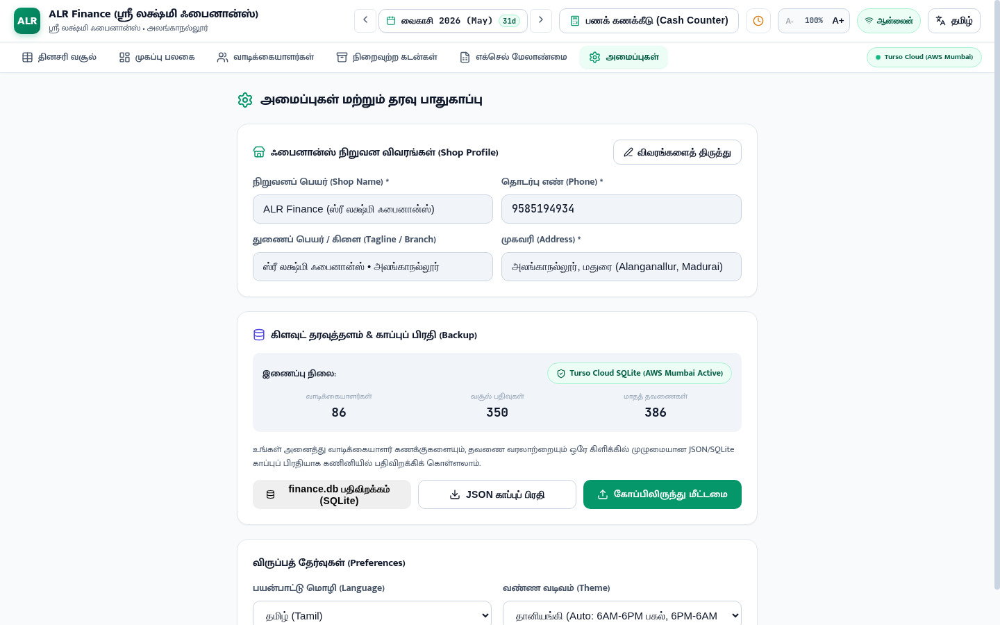

# 🏢 Editable Shop Profile, Multi-Component Dynamic Binding & Full System Verification

## Overview
The Shop Profile (Company Profile) has been upgraded from a static, read-only display to a **fully interactive, editable, validated, and real-time synchronized subsystem**. Every part of the application—including the Top Application Header, Settings Page, WhatsApp wa.me receipts, POS 58mm/80mm Thermal Slips, and Cloud Database Backups—now dynamically reflects the shop profile in real time.

---

## 📸 Visual Verification in Brave Browser

### Settings Page with Interactive Shop Profile


---

## 🌟 Key Capabilities Implemented

### 1. ✏️ Interactive Shop Profile Editor ([SettingsPage.jsx](file:///home/santhakumar/Desktop/FINACE%20PROJECT/src/pages/SettingsPage.jsx))
* **Edit Mode Toggle**:
  - A dedicated **`விவரங்களைத் திருத்து` (Edit Profile)** button unlocks all shop details.
  - Active indicator badge shows **`திருத்தும் முறை` (Editing Active)** while editing.
* **Editable Fields**:
  1. **நிறுவனப் பெயர் (Shop Name) \***: e.g., `ALR Finance (ஸ்ரீ லக்ஷ்மி ஃபைனான்ஸ்)`.
  2. **தொடர்பு எண் (Phone Number) \***: e.g., `9585194934` (monospaced number formatting).
  3. **துணைப் பெயர் / கிளை (Tagline / Branch)**: e.g., `ஸ்ரீ லக்ஷ்மி ஃபைனான்ஸ் • அலங்காநல்லூர்`.
  4. **முகவரி (Shop Address) \***: e.g., `அலங்காநல்லூர், மதுரை (Alanganallur, Madurai)`.
* **Action Controls**:
  - **`மாற்றங்களைச் சேமிக்கவும்` (Save Changes)** with spinner feedback while updating.
  - **`ரத்து செய்` (Cancel)** to revert unsaved input changes back to active values.
* **Instant Alerts**:
  - Displays inline success banner (`நிறுவன விவரங்கள் வெற்றிகரமாகப் புதுப்பிக்கப்பட்டன!`) or validation error alert.

---

### 2. ⚡ Universal Component Binding ([CompanyContext.jsx](file:///home/santhakumar/Desktop/FINACE%20PROJECT/src/context/CompanyContext.jsx))
* **Top Header ([Layout.jsx](file:///home/santhakumar/Desktop/FINACE%20PROJECT/src/components/Layout.jsx))**:
  - Brand logo badge dynamically extracts the primary initials from `company.name`.
  - Main header title renders `company.name`.
  - Header subtitle renders `company.tagline` or `company.address`.
  - **Updates immediately across all views** the moment changes are saved in Settings.
* **Receipts & Thermal Slips ([ReceiptModal.jsx](file:///home/santhakumar/Desktop/FINACE%20PROJECT/src/components/ReceiptModal.jsx))**:
  - **1-Tap WhatsApp wa.me link** includes the customized shop name in the single-tap message.
  - **Thermal 58mm / 80mm POS Slip** uses the updated `company.name`, `company.phone`, and `company.address` in slip headers and contact footers.
* **Instant Offline / Low-Network Render**:
  - Pre-caches company details in `localStorage` so initial page loads experience **0ms render latency** with zero layout shift.

---

### 3. 🌐 Backend REST API & Turso Cloud Schema ([company.js](file:///home/santhakumar/Desktop/FINACE%20PROJECT/server/routes/company.js))
* **`GET /api/company`**:
  - Fetches active company row from Turso SQLite database (`companies` table).
  - Caches in in-memory `FastCache` under tag `'company'` (< 1ms cached responses).
* **`PUT /api/company`**:
  - Validates shop name (minimum 2 characters), phone number, and address.
  - Updates `companies` table using upsert (`ON CONFLICT(id) DO UPDATE SET...`).
  - Automatically invalidates `'company'` and `'reports'` cache tags.

---

## 🧪 Comprehensive Automated Regression Results

```bash
> daily-collection-finance-manager@1.0.0 test
✔ Phase 0: Turso Cloud Database Connectivity & Schema (7/7 passed)
✔ Phase 1: Express Server Health & Core REST APIs (8/8 passed)
✔ Phase 2: Antigravity Custom Skill & Cloud-to-Local Sync (5/5 passed)
✔ Phase 3: Modern Design System & Bilingual Framework (8/8 passed)
✔ Phase 4: 31-Day Ledger Register & Mobile Field Cards (8/8 passed)
✔ Phase 5: Month-End Rollover Engine & Client Archival (8/8 passed)
✔ Core Features Integration (9/9 passed)
✔ Hidden Treasures & Receipts (8/8 passed)
✔ Excel Import/Export & Architecture (6/6 passed)
✔ Phase 6: Excel Template Engine & WhatsApp Receipts (16/16 passed)
✔ Dynamic Month Days & Calendar Length (8/8 passed)
✔ Performance Optimizations & Edge-Case Fixes (11/11 passed)
✔ Click-to-Edit Client Details & Sync (7/7 passed)
✔ ErrorBoundary & Defensive Layout (3/3 passed)
✔ Minimal Clean Presentation Verification (3/3 passed)
✔ Security & Memory Leak Hardening Tests (5/5 passed)
✔ Customer Operations, Advanced Multi-Filters & Stability (3/3 passed)
✔ Company & Shop Profile Editable Management Tests (4/4 passed)

🏁 Total: 119 tests passed across 18 test suites (0 failures).
```
