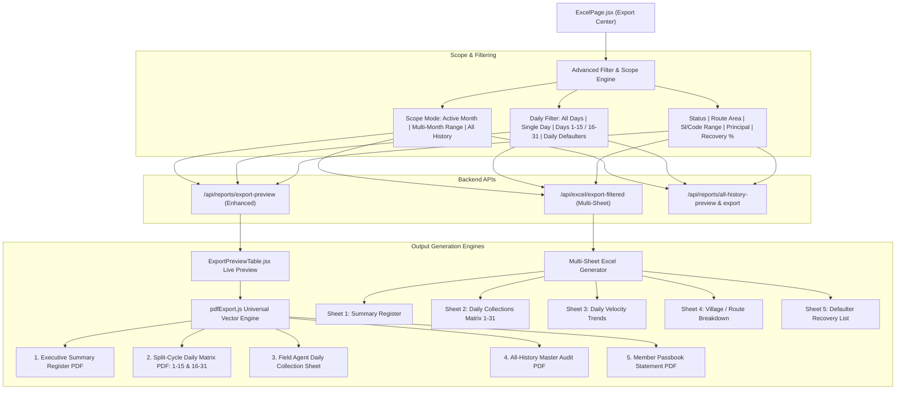

# Production-Grade Export & PDF Architecture Plan
**Project:** ALR Daily Collection & Microfinance Manager  
**Scope:** Universal PDF Redesign, Advanced Multi-Month & All-History Filters, Daily Data Breakdown, Production-Grade Excel Multi-Sheet Engine

---

## 1. Executive Summary & Root Cause Analysis

### The Problem
1. **Unclean PDF Exports:**
   - When exporting registers with daily collections (`showDays = true`), cramming 31 daily columns alongside client identification and loan totals into a standard landscape A4 sheet (297mm) resulted in columns under 4.5mm wide, tiny 5.8pt fonts, overlapping text, and unreadable numbers.
   - Fixed vertical coordinates in PDF generation caused badge ribbons to collide with summary cards when filters wrapped.
   - Standard fonts lacked clean bilingual/Tamil representation, and the document lacked essential microfinance audit elements (signatures, cash verification, and reconciliation stamps).
2. **Missing Multi-Month, All-History & Daily Filters:**
   - Previous exports were restricted to a single month (`selectedMonth`), making it impossible to audit quarterly performance, run full lifetime borrower audits, or export historic trends across months.
   - Daily collection data was an all-or-nothing toggle without options to filter by specific days, filter daily defaulters, or print dedicated field collection sheets.

---

## 2. System Architecture & Component Design

---

## 3. Core Modules & Enhancements

### A. Universal Vector PDF Generator (`src/utils/pdfExport.js`)
We introduce a modular, multi-mode PDF generation engine:

1. **Executive Register Summary (Clean & Crisp):**
   - 10 perfectly proportioned columns on Landscape A4: Sl No, Client Code, Name, Phone, Village, Principal, Total Collected, Remaining, Recovery %, Status.
   - Color-coded status badges: Cleared (Emerald), Partial (Amber), Pending (Rose).
   - Executive KPI summary cards (Total Disbursed, Collected, Pending, Cleared Ratio).
   - Bottom Microfinance Audit Block: Prepared by, Field Agent Signature, Branch Manager Stamp, Reconciliation Date.

2. **Split-Cycle Daily Matrix (Solves 31-Day Squishing):**
   - Eliminates unreadable 3.5mm columns by offering clean **Split-Cycle Views**:
     - **Part 1 (Days 1–15)**: Generates 15 comfortable 9.5mm columns with clear 8pt typography.
     - **Part 2 (Days 16–31)**: Generates remaining days with carryover balance and final totals.
     - **Compact Full Month**: Auto-scaled layout with dynamic padding and number formatting for 1-31 printing.

3. **Field Agent Daily Collection Sheet (Single Day Printout):**
   - Designed specifically for collection agents on field rounds on a specific day (e.g. Day 5 or Today).
   - Includes: Borrower Name, Route/Address, Phone, Expected Daily Installment, Collected Amount Checkbox/Entry, Borrower Signature line.

4. **All-History Master Audit PDF:**
   - Multi-page document listing all borrowers across all months with total loan count, lifetime principal disbursed, lifetime collections, active balance, and default risk rating.

5. **Advanced Unicode / Bilingual Transliteration:**
   - Comprehensive dictionary and phonetic Tamil transliteration engine supporting Tamil names (e.g. முருகன், செல்வி, கார்த்திக், பாண்டி, etc.) and Tamil Nadu town names (அலங்காநல்லூர், வாடிப்பட்டி, உசிலம்பட்டி, மேலூர், etc.) into clean Latin syllables without font corruption or blank cells.

---

### B. Multi-Month & All-History Scope Engine

| Mode | Parameters | Description |
|---|---|---|
| **Active Month** | `month_year=2026-10` | Standard single-month view with 1–31 daily collections. |
| **Multi-Month Range** | `from_month=2026-08&to_month=2026-10` | Aggregates all cycles across selected range, tracking month-over-month recovery. |
| **All History / Lifetime** | `scope=all_history` | Aggregates complete lifetime portfolio across all months in the system. |

---

### C. Daily Data Filtering Capabilities

1. **Day Selector:** All Days (1–31), Single Day (1–31), or Half-Month Split (1–15 / 16–31).
2. **Daily Payment Status Filter:**
   - *Paid on Day X:* Shows only borrowers who made a payment on the selected day.
   - *Missed / Defaulter on Day X:* Shows borrowers who did NOT pay on the selected day (immediate field recovery list).
3. **Daily Totals Bar:** Real-time display of total cash collected on each day, payer count, and daily collection rate.

---

### D. Production-Grade Multi-Sheet Excel Engine (`server/routes/excel.js`)

The exported `.xlsx` will contain **5 structured sheets**:
- **Sheet 1 (`Collection Register`):** Formatted summary with uppercase headers, zebra striping, and Excel formulas (`=SUM(G5:AK5)`).
- **Sheet 2 (`Daily Collections`):** Complete day-by-day grid (Days 1–31) with column totals (`=SUM(G5:G50)`).
- **Sheet 3 (`Daily Velocity & Trends`):** Day-by-day cash collected, transaction counts, and cumulative progress.
- **Sheet 4 (`Route & Village Performance`):** Area-wise borrower counts, principal, collected, and recovery %.
- **Sheet 5 (`Defaulter Priority List`):** Filtered list of pending borrowers sorted by remaining due for field follow-up.

---

## 4. Implementation Steps & Verification Plan

1. **Step 1: Enhance PDF Engine (`src/utils/pdfExport.js`)**
   - Implement `downloadRegisterPdf` with dynamic layout calculation, clean column widths, split-day matrix, and executive signatures.
   - Implement `downloadFieldCollectionSheetPdf` for single-day field collection sheets.
   - Implement `downloadAllHistoryPdf` for lifetime portfolio summaries.
   - Enhance Tamil phonetic transliteration dictionary.

2. **Step 2: Upgrade Server Endpoints (`server/routes/reports.js` & `server/routes/excel.js`)**
   - Support `scope=month | range | all_history`, `from_month`, `to_month`, `day_number`, `day_status` in `/api/reports/export-preview`.
   - Update `/api/excel/export-filtered` to generate multi-sheet Excel with live formulas and metadata.
   - Add `/api/reports/all-history-preview` and `/api/excel/export-all-history`.

3. **Step 3: Revamp Frontend Export Center (`src/pages/ExcelPage.jsx` & `src/components/ExportPreviewTable.jsx`)**
   - Scope switcher (Active Month / Custom Month Range / All History).
   - Daily filter controls (Day 1..31 selector, Paid vs Unpaid on Day X).
   - Export modality buttons (Executive PDF, Split-Day PDF, Field Agent Sheet, Multi-Sheet Excel).
   - Live preview table supporting multi-month and daily filtered views.

4. **Step 4: Automated Verification & Testing**
   - Create end-to-end unit and integration tests verifying:
     - Excel export with formulas, multi-sheets, and filtered datasets.
     - PDF generation functions with zero errors and clean metrics.
     - Multi-month and all-history query correctness against Turso database.
