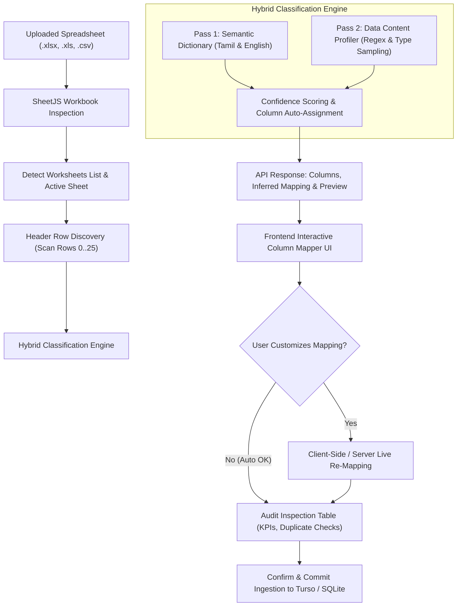

# Enterprise Universal Excel & CSV Ingestion Platform

## Goal Description
Transform the current rigid Excel import system into an enterprise-grade, universal data ingestion platform capable of parsing arbitrary spreadsheet styles, column orders, and data layouts without requiring fixed templates. The platform will combine **deep semantic header recognition**, **data-content heuristics profiling** (inspecting actual values like phones, currencies, and names), **multi-sheet workbook support**, and an **interactive visual column mapping UI** that empowers operators to review, override, and verify column assignments before committing data to the database.

---

## User Review Required

> [!IMPORTANT]
> **No Rigid Template Constraints**: Operators will no longer need to download or format according to the default ALR template. Any customer list, tally export, field collection sheet, bilingual register, or Google Sheet (.xlsx, .xls, .csv) will be ingested seamlessly.

> [!NOTE]
> **Non-Destructive Ingestion & Duplicate Handling**: When an imported borrower matches an existing client in the database (by phone number, client serial number, or exact name), their profile will be updated non-destructively without wiping prior loan cycles or payment ledger history.

---

## Open Questions

> [!TIP]
> None. The architecture accommodates both single-sheet and multi-sheet workbooks, full 31-day registers (with daily payment columns) as well as pure client directories (with only principal amounts and contact details).

---

## Proposed Changes



---

### Backend: Enhanced Parser & Classification Engine

#### [MODIFY] `server/utils/excelParser.js`
- **Deep Header Row Discovery**: Scans rows 0 through 25, evaluating non-empty cell density, string ratios, and header keyword frequencies to accurately pinpoint the header row even if preceded by company banners, blank rows, or merged titles.
- **Expanded Bilingual Semantic Dictionary**:
  - **Customer Name**: `name`, `customer`, `borrower`, `client`, `party`, `applicant`, `member`, `full name`, `a/c holder`, `பெயர்`, `வாடிக்கையாளர்`, `நபர்`, `மனுதாரர்`, `உறுப்பினர்`, `ஆள்`, `கடன் வாங்கியவர்`.
  - **Phone / Mobile**: `phone`, `mobile`, `cell`, `contact`, `primary mobile`, `tel`, `தொலைபேசி`, `அலைபேசி`, `கைபேசி`, `போன்`, `எண்`.
  - **Village / Town**: `village`, `town`, `city`, `district`, `taluk`, `gramam`, `ur`, `oor`, `கிராமம்`, `ஊர்`, `நகரம்`, `மாவட்டம்`, `தாலுகா`.
  - **Area / Ward / Street**: `area`, `ward`, `street`, `colony`, `nagar`, `bazaar`, `salai`, `route`, `sector`, `பகுதி`, `வட்டாரம்`, `தெரு`, `நகர்`, `காலனி`, `பஜார்`, `சாலை`.
  - **Full Address**: `address`, `residence`, `location`, `landmark`, `residential address`, `முகவரி`, `விலாசம்`, `இருப்பிடம்`.
  - **Principal Amount**: `principal`, `sanction`, `loan`, `amount`, `credit limit`, `disbursed`, `advance`, `அசல்`, `தொகை`, `கடன் தொகை`, `அசல் தொகை`, `வழங்கிய தொகை`.
  - **Serial Number**: `sl no`, `s no`, `slno`, `sno`, `serial`, `code`, `client code`, `id`, `ref`, `account ref`, `வரிசை எண்`, `குறியீடு`.
  - **Registration Date**: `date`, `reg date`, `join date`, `start date`, `தேதி`, `துவக்க தேதி`, `பதிவு தேதி`.
  - **Daily Dues**: `Day 1`..`Day 31`, `1`..`31`, `D1`..`D31`.
- **Data Content Profiler (Pass 2 Heuristics)**:
  - If a column has no matching header, the profiler examines the first 10-20 sample rows:
    - If >60% of values match 10-digit Indian phone patterns (`/^[6-9]\d{9}$/`), assign `phoneCol`.
    - If >60% of values are numbers typically representing loan limits (e.g. ₹5,000 to ₹10,00,000), assign `principalCol`.
    - If sequential integers (1, 2, 3...) or prefixed codes (`CLI-`, `ACC-`), assign `slNoCol`.
    - If standard date strings (`YYYY-MM-DD`, `DD/MM/YYYY`), assign `dateCol`.
- **Dynamic Mapping Support**: Allow callers to provide an explicit `column_mapping` object overriding auto-detection.

---

### Backend: API Endpoints

#### [MODIFY] `server/routes/excel.js`
- **Enhanced `POST /api/excel/preview`**:
  - Accept `sheet_name` and optional `column_mapping` in `req.body`.
  - Return:
    - `sheet_names`: List of all worksheets in the workbook.
    - `active_sheet`: Current worksheet being previewed.
    - `available_columns`: Array of `{ colIndex, headerName, sampleValues }`.
    - `detected_mapping`: System-assigned column mapping with confidence score.
    - `preview_rows`: Normalized row records with issue flags (duplicates, missing fields).
    - `summary`: KPIs (Total Rows, Valid Rows, Total Principal, Duplicate Phones).
- **Enhanced `POST /api/excel/import`**:
  - Accept `sheet_name`, `column_mapping`, and `duplicate_handling` ('update' vs 'skip').
  - Execute batch upsert for clients and daily collection records using the validated mapping.

---

### Frontend: Modern Interactive Column Mapper & Ingestion Deck

#### [MODIFY] `src/pages/ExcelPage.jsx`
- **Worksheet Switcher**: If the uploaded file contains multiple sheets, render a selector pill allowing the user to toggle sheets.
- **Visual Column Mapping Deck**:
  - Collapsible/expandable mapping panel displaying target fields:
    - *Borrower Name* (`Required`)
    - *Mobile Number*
    - *Village / Town*
    - *Area / Ward*
    - *Full Address*
    - *Principal Amount*
    - *Serial Number / Code*
    - *Registration Date*
  - For each target field, a select dropdown populated with sheet columns and sample data previews from rows 1 & 2.
  - "Auto-Detected ✓" badge for automatically matched columns.
  - Changing any dropdown immediately re-maps the preview records in real-time.
- **Audit Validation Table**:
  - Visual status pill for each row (`Valid`, `Phone Warning`, `Duplicate Name`, `Missing Field`).
  - Search filter and page controls.
  - Final "Confirm Import" button with non-destructive execution.

---

## Verification Plan

### Automated Tests
1. **Unit & Parser Tests**:
   - Test diverse column order configurations (e.g., Phone in Col 0, Name in Col 3, Principal in Col 1).
   - Test Tamil-only headers, English-only headers, and mixed bilingual headers.
   - Test header rows starting at row 1, row 3, row 5.
   - Test sheets without explicit headers relying on data content profiler.
   - Test multi-sheet workbooks.
2. **End-to-End API Tests**:
   - Test `POST /api/excel/preview` with custom `column_mapping`.
   - Test `POST /api/excel/import` inserting and updating clients non-destructively.
3. **Execution Commands**:
   ```bash
   node --test test/client_excel_test_validation.test.js
   node --test test/duplicate_and_area_village_preview.test.js
   npm run build
   ```

### Manual Verification
1. Upload a spreadsheet with non-standard column arrangements.
2. Verify the Column Mapper correctly identifies fields or allows manual dropdown adjustment.
3. Verify the preview updates live upon changing a column dropdown.
4. Confirm import and verify clients appear in the Client Directory and Collection Ledger.
